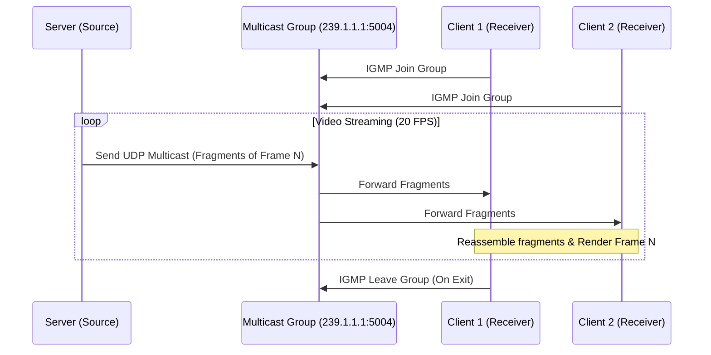

# Kế hoạch triển khai Project 02: Video Streaming using IP Multicast

Bản kế hoạch này mô tả chi tiết phương án thiết kế hệ thống phát video trực tuyến (Video Streaming) sử dụng giao thức IP Multicast và cơ chế truyền tải gói tin tùy chỉnh (Custom Packet Format) trên nền tảng ngôn ngữ Python.

## 1. Yêu Cầu Kỹ Thuật & Kiến Trúc
Hệ thống bao gồm hai thành phần chính:
* **Server**: Đọc luồng video MJPEG, chia nhỏ (fragment) mỗi frame ảnh thành các gói tin UDP có kích thước nhỏ hơn MTU (1500 bytes), bổ sung Custom Header và gửi tới địa chỉ Multicast IP `239.1.1.1:5004` với tốc độ ~20 FPS. Tự động lặp lại video khi kết thúc.
* **Client**: Join vào Multicast Group, nhận các gói tin UDP, phân tích Custom Header để lắp ráp lại (reassemble) các mảnh thành frame ảnh hoàn chỉnh, giải mã và hiển thị lên màn hình. Client cũng cần thống kê tỉ lệ mất gói (Packet Loss Rate) và tỉ lệ mất khung hình (Frame Loss Rate).



---

## 2. Thiết Kế Custom Packet Format
Mỗi gói tin gửi qua mạng Multicast sẽ chứa **12 bytes Custom Header** ở đầu, theo sau là phần dữ liệu ảnh JPEG thô (Payload).
Sử dụng module `struct` của Python với định dạng `!IHHH` (Big-Endian):

| Trường (Field) | Kiểu dữ liệu | Kích thước | Mô tả |
| :--- | :--- | :--- | :--- |
| **Global Seq Num** | `unsigned int` (I) | 4 bytes | Số thứ tự gói tin tăng dần trên toàn hệ thống (dùng để phát hiện mất gói tin). |
| **Frame ID** | `unsigned short` (H) | 2 bytes | ID của frame hiện tại (0, 1, 2...). |
| **Fragment Index** | `unsigned short` (H) | 2 bytes | Vị trí của mảnh hiện tại trong frame (0, 1, ..., Total - 1). |
| **Total Fragments** | `unsigned short` (H) | 2 bytes | Tổng số mảnh tạo nên frame này. |
| **Data Length** | `unsigned short` (H) | 2 bytes | Kích thước phần JPEG payload đi kèm trong gói (tối đa 1400 bytes). |

---

## 3. Danh Sách Các File Cần Tạo Mới

Tất cả mã nguồn của Project 02 sẽ được đặt trong thư mục mới: [Project_02](file:///d:/2026DaiHoc/LapTrinhMang/Project01/src/Project_02).

### [NEW] [Packet.py](file:///d:/2026DaiHoc/LapTrinhMang/Project01/src/Project_02/Packet.py)
* Lớp `Packet` đóng vai trò đóng gói (encode) và giải gói (decode) dữ liệu nhị phân theo cấu trúc Custom Header đã thiết kế.
* Cung cấp các helper methods để đọc thông tin từ Header.

### [NEW] [VideoStream.py](file:///d:/2026DaiHoc/LapTrinhMang/Project01/src/Project_02/VideoStream.py)
* Tái cấu trúc lớp `HDVideoStream` từ Project 01.
* Hỗ trợ tìm kiếm marker `SOI (0xFFD8)` và `EOI (0xFFD9)` để đọc file MJPEG thô theo từng frame.
* Bổ sung cơ chế loop video (tự động reset con trỏ file về đầu khi kết thúc).

### [NEW] [Server.py](file:///d:/2026DaiHoc/LapTrinhMang/Project01/src/Project_02/Server.py)
* Chấp nhận tham số dòng lệnh: `python Server.py <file_path.Mjpeg>`.
* Cấu hình UDP Multicast socket (thiết lập TTL = 1 hoặc tùy chọn).
* Chia nhỏ frame JPEG nhận được từ `VideoStream` thành các mảnh nhỏ (kích thước tối đa 1400 bytes payload).
* Sử dụng vòng lặp vô hạn kết hợp `time.sleep(0.05)` để giữ tốc độ phát video ~20 FPS.

### [NEW] [Client.py](file:///d:/2026DaiHoc/LapTrinhMang/Project01/src/Project_02/Client.py)
* Xây dựng giao diện hiển thị video (sử dụng OpenCV `cv2.imshow` hoặc giao diện UI Tkinter mượt mà).
* Tạo luồng phụ (Receiver Thread) để nhận các gói UDP Multicast liên tục và lắp ráp frame nhằm tránh block UI Thread.
* Quản lý bộ đệm ghép mảnh (Reassembly Buffer) để xử lý gói tin đến lệch thứ tự hoặc bị mất.
* Tích hợp thống kê hiệu năng thời gian thực:
  * **Packet Loss Rate**: Tính toán dựa trên độ lệch của `Global Seq Num` nhận được.
  * **Frame Loss Rate**: Đánh dấu frame bị hỏng khi chuyển sang Frame ID lớn hơn mà frame cũ chưa đủ mảnh.
  * Hiển thị trực tiếp các thông số này lên màn hình video hoặc giao diện điều khiển.

---

## 4. Kế Hoạch Kiểm Thử (Verification Plan)

### Kiểm Thử Tự Động / Giả Lập Môi Trường Mạng Xấu (Loss Test)
* Phát triển một script kiểm thử trung gian hoặc tích hợp tùy chọn giả lập mất gói ở Client (ví dụ: ngẫu nhiên drop 5% - 10% gói nhận được) để kiểm tra xem thuật toán phát hiện mất gói tin và hiển thị ảnh của Client có hoạt động chính xác không (không bị crash khi ảnh bị lỗi, hiển thị đúng chỉ số thống kê).

### Kiểm Thử Thủ Công (Manual Verification)
1. **Chạy Server**:
   ```bash
   python Server.py movie.Mjpeg
   ```
2. **Khởi chạy nhiều Client đồng thời**:
   Chạy 2-3 tiến trình `python Client.py` trên cùng một máy (hoặc các máy khác nhau trong cùng mạng LAN) để xác minh tính năng IP Multicast (Server chỉ gửi 1 stream, tất cả Client đều nhận được video đồng thời).
3. **Kiểm tra chức năng Loop**:
   Xác minh video tự động phát lại khi hết file mà không làm treo Server hay Client.
4. **Kiểm tra Leave Group**:
   Khi đóng một Client, các Client còn lại vẫn nhận video bình thường. Server không bị ảnh hưởng.
